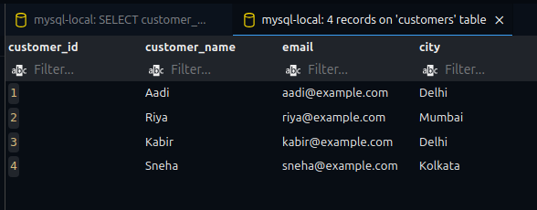

# SQL for Data Analysis – Task 3

## Objective
Use SQL queries to extract and analyze data from a sample **Ecommerce SQL database**.

---

## Tools Used
- **MySQL** (You can also use PostgreSQL or SQLite)
- SQL execution via:
  - MySQL Workbench, VS Code (SQLTools), or SQLiteStudio
- Dataset: Sample `Ecommerce` data with tables for `customers`, `orders`, `products`, and `order_items`

---

## Files Included
- `ecommerce_analysis_task3.sql`: SQL file containing:
  - Schema creation
  - Sample data inserts
  - Analysis queries

---

## Database Schema
**Tables created:**
- Customers Table:
  - `customers (customer_id, customer_name, email, city)`
  

- `products (product_id, product_name, price)`
- `orders (order_id, customer_id, order_date)`
- `order_items (item_id, order_id, product_id, quantity)`

---

## Tasks & Queries

### 1. **Basic SELECT, WHERE, ORDER BY**
```sql
SELECT customer_name, city 
FROM customers 
WHERE city = 'Delhi' 
ORDER BY customer_name;
