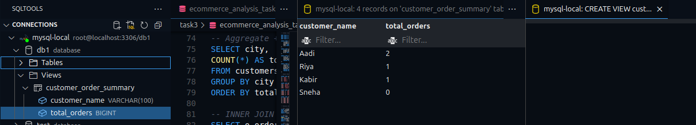

# SQL for Data Analysis – Task 3

## Objective
Use SQL queries to extract and analyze data from a sample **Ecommerce SQL database**.

---

## Tools Used
- **MySQL** (You can also use PostgreSQL or SQLite)
- SQL execution via:
  - MySQL Workbench, VS Code (SQLTools), or SQLiteStudio
- Dataset: Sample `Ecommerce` data with tables for `customers`, `orders`, `products`, and `order_items`

---

## Files Included
- `ecommerce_analysis_task3.sql`: SQL file containing:
  - Schema creation
  - Sample data inserts
  - Analysis queries

---

## Database Schema
**Tables created:**
- Customers Table:
  - `customers (customer_id, customer_name, email, city)`
  

- Products Table:
  - `products (product_id, product_name, price)`
  
  

- Orders Table:
  - `orders (order_id, customer_id, order_date)`
  
  

- Order-items Table:
  - `order_items (item_id, order_id, product_id, quantity)`
  
---

## Tasks & Queries

### 1. **Basic SELECT, WHERE, ORDER BY**
```sql
SELECT customer_name, city 
FROM customers 
WHERE city = 'Delhi' 
ORDER BY customer_name;
```
- Output:


### 2. **GROUP BY + Aggregate Functions**
```sql
SELECT city, COUNT(*) AS total_customers 
FROM customers 
GROUP BY city 
ORDER BY total_customers DESC;
```
- Output:


### 3. **INNER JOIN**
```sql
SELECT o.order_id, c.customer_name, o.order_date 
FROM orders o 
INNER JOIN customers c ON o.customer_id = c.customer_id;
```
- Output:


### 4. **LEFT JOIN**
```sql
SELECT c.customer_name, o.order_id 
FROM customers c 
LEFT JOIN orders o ON c.customer_id = o.customer_id;
```
- Output:


### 5. **Subquery**
```sql
SELECT customer_name FROM customers 
WHERE customer_id IN (
    SELECT customer_id FROM orders 
    GROUP BY customer_id 
    HAVING COUNT(*) > 1
);
```
- Output:


### 6. **Create View**
```sql
CREATE VIEW customer_order_summary AS
SELECT c.customer_name, COUNT(o.order_id) AS total_orders
FROM customers c
LEFT JOIN orders o ON c.customer_id = o.customer_id
GROUP BY c.customer_name;
```
- Output:



### 7. **Query Optimization with Index**
```sql
CREATE INDEX idx_customer_id ON orders(customer_id);
```
- Output:

  


